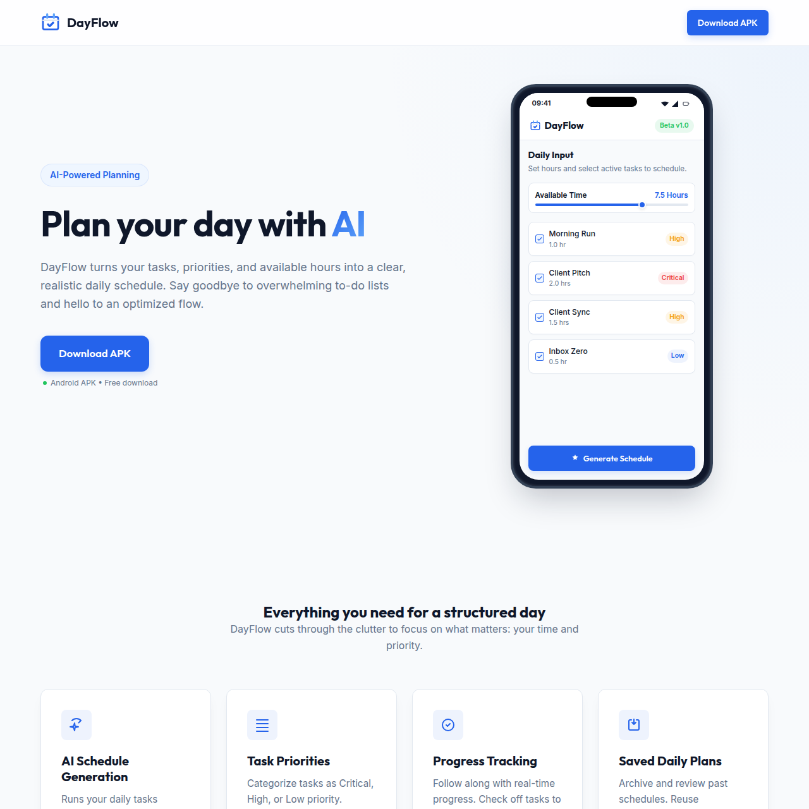

# DayFlow



DayFlow is an AI-powered daily planner for Android. Add your tasks, set priorities, choose how many hours you have available, and generate a realistic schedule for your day.

The app helps users turn a messy task list into a clear plan with task tracking, progress updates, and saved daily schedules.

## Features

- Add, edit, complete, and delete daily tasks
- Set task priority: High, Medium, or Low
- Choose available hours for the day
- Generate an AI schedule using Gemini
- View schedule blocks in a clean timeline layout
- Track completed tasks and daily progress
- Save tasks and generated plans locally
- Simple onboarding and responsive Material UI

## Tech Stack

- Kotlin
- Android Jetpack Compose
- Material 3
- Room Database
- ViewModel and StateFlow
- Retrofit and OkHttp
- Gemini API
- Gradle Kotlin DSL

## Getting Started

### Prerequisites

- Android Studio
- JDK 11 or newer
- A Gemini API key

### Setup

1. Clone the repository:

```bash
git clone https://github.com/udayxgoel/dayflow.git
cd dayflow
```

2. Create a `.env` file in the project root:

```env
GEMINI_API_KEY=your_gemini_api_key_here
```

3. Open the project in Android Studio.

4. Let Gradle sync the project.

5. Run the app on an emulator or Android device.

## Build APK

To build a debug APK:

```bash
./gradlew assembleDebug
```

On Windows:

```powershell
.\gradlew.bat assembleDebug
```

The generated APK will be available inside:

```text
app/build/outputs/apk/debug/
```

## Project Structure

```text
app/src/main/java/com/example/
|-- data/          # Room database, DAO, models, repository
|-- network/       # Gemini API models and Retrofit client
|-- ui/            # Planner ViewModel and UI state
`-- MainActivity.kt
```

## Contributing

Contributions are welcome.

1. Fork the repository
2. Create a branch: `git checkout -b feature/your-feature-name`
3. Make your changes
4. Commit: `git commit -m "Add your feature"`
5. Push: `git push origin feature/your-feature-name`
6. Open a pull request

## Issues

If you find a bug or setup issue, please open an issue with:

- a clear title
- a short description of the problem
- steps to reproduce
- screenshots or logs if relevant
- your environment details

## License

This project is currently licensed under **ISC**
